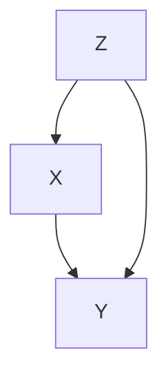
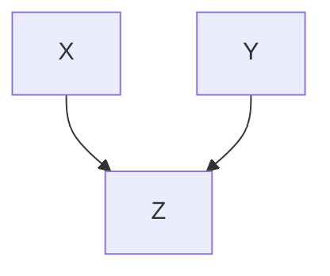
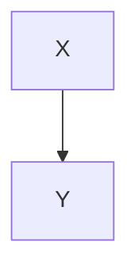

# 因果関係・因果効果・反実仮想：
- 相関関係(狭義の):
  - 2つの変数の間に、一方の変数の値が大きいときに多方の変数の値も大きい(小さい)という、直線的な関係がある場合.
- 因果関係:
  - 要因Xを変化させた時に、要因Yも変化する場合、「XとYの間に因果関係がある」という。 
  - 要因Xを原因、要因Yをその結果、と呼ぶ.
  - 原因を示す変数＝原因変数、結果を表す変数＝結果変数(アウトカム)と呼ぶ.
  - 要因を操作して変化させる事を、介入(Intervention)、処置(Treatment)等という.
- 因果効果:
  - 単に因果関係の有無だけではなく、その関係の強さも知りたい時がある.	＝＞因果効果と呼ばれる.
  - 人を対象とした場合には、「同じ人物が、介入を受けた場合の結果変数の値と、介入を受けなかった場合の結果変数の値の差」
  - ex)介入を補習、結果変数をテストの点数とする.
    - この時の因果効果は、「Aさんが補習を受けた場合のテストの点数」と「Aさんが補習を受けなかった場合のテストの点数」の差によって求められる。
- 反実仮想：
  - 「もし●●だったら結果変数がどうなったかを考える事」を反実仮想(反事実, Counterfactual)という。
  
# 交絡

# 観察研究による因果推論：
## 最も基本的な手法①層別解析
## 最も基本的な手法②回帰モデルの利用
## その他の因果推論の方法：


# 回帰分析を用いた因果効果の評価
## 回帰係数と因果効果の値が「ズレる」時
因果構造が成立している場合には、「X->Yの回帰係数(XとYの確率的共編関係に基づく)」と「X->Yの介入効果(XとYの間の因果関係に基づく)」の間に量的なズレが生じる事がある。
本文における介入効果の定義：
「変数Xを一単位分だけ介入により変化させた時の、変数Yの平均的な変化量」を「X->Yの介入効果」と呼ぶ
事にする。
## 「人口池の水位の例」と、因果の向きが逆の時に生じる「ズレ」


## 因果の上流側に共通の要因が存在する事により生じる「ズレ」


## 合流点で選抜する事により生じる「ズレ」


## 中間変数を用いる事により生じる「ズレ」
  ```mermaid
  flowchart TD
  X --> Y

  ```


# バックドア規準の話「どの因子を説明変数に採用するべき？」




# 参考
- 岩波データサイエンス.3
- sss
- sss
