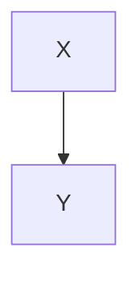
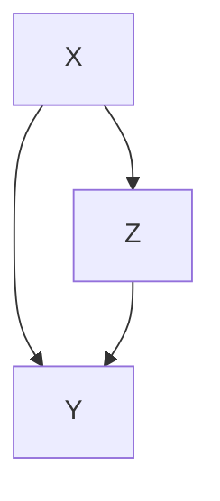
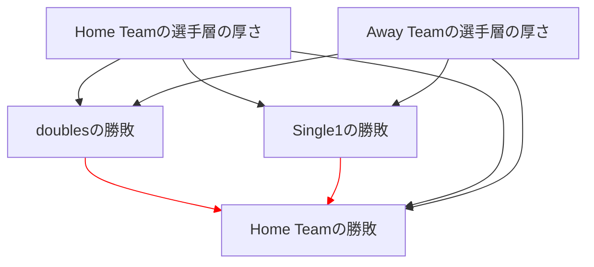
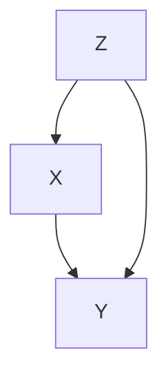
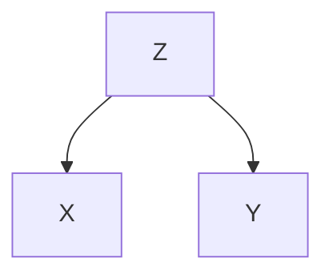

<!-- タイトル：バックドア基準について -->
# 1. 回帰分析の観点から-どんな時に回帰係数と介入効果(因果効果)の値が「ズレる」??-
「ズレる」パターンは大きく3パターンあります。
  1. 「因果の方向が逆」のパターン
  2. 「上流側に共通の要因がある」パターン
  3. 「合流点で選別している」パターン

ここからは、「介入効果」と因果構造の関係をイメージする為の例として、「ある丘にある複数の人口池の水位」の例を考えます。
## まずは単純な2変量で「ズレない」パターンを考える.
まずは、単純な2変量の例として、丘にある2つの人口池(X池、Y池)を考えます。
丘の上側にX池、下側にY池があり、それらは水路で繋がっているとします。
各池の水位をそれぞれ、X、Yとした時、

下流側の水位Yは上流側の水位Xに依存して、
$Y=\beta_{X, Y} +\gamma + 誤差$
の式で決まるとします。
今回の例では、$\beta_{X,Y}=0.5$, $\gamma=10cm$であるとしましょう。
つまり、例えば$X=80cm$の時、$Y=0.5\times 80 + 10 +誤差=50cm +誤差$となります！
(これ以降は、記述の簡略化の為に誤差項は省略します)

ここで、「X→Yの介入効果」について考えてみます。
上流側の水位Xを人為的な介入により1cm増やしたとします。
この時、下流側の水位は上式に従い、$\beta_{X,Y}$に相当する0.5cmだけ増加する事になります。
この場合の「X->Yの介入効果」は0.5cmであり、「Yに対するXの回帰係数$\beta_{X,Y}$の値」と合致します。

しかし残念ながら、必ずしも回帰係数の値をそのまま介入効果として解釈できるわけではありません...。

## ズレるパターン1「因果の方向が逆」のパターン
まず「因果の方向が逆」のパターンとして、前節の例における「Y→Xの介入効果」について考えてみましょう。

前節で登場した$Y=\beta_{X, Y} +\gamma$の式を変形すると、
$X=\frac{1}{\beta_{X,Y}} Y - \frac{\gamma}{\beta_{X,Y}}$
となります。
しかし、下流側の水位Yを人為的な介入により1cm増やした場合に、上流側の水位が$\frac{1}{\beta_{X,Y}}=2cm$増えるかというと、もちろんそんな奇妙なことは起こりません。

上流-下流関係により水は高いところから低いところにしか流れない為(=因果関係の話の例として、水のイメージで話しています！)、下流側の水位を操作しても上流側の水位には影響しないのです。
つまり「Y→Xの介入効果」はあくまで0であり、$\frac{1}{\beta_{X,Y}}$とも、Y→Xの単回帰係数$\beta_{Y,X}$とも一致しません！

この例のように、興味の対象となる介入効果における因果の矢印の向き(Y->X)と、データ生成過程における因果関係の矢印の向きが(X->Y)が異なる場合には、**回帰係数の値と介入効果の間には「ズレ＝Bias」が生じてしまいます**。

## ズレるパターン2「上流側に共通の要因がある」パターン

## ズレるパターン3「合流点で選別している」パターン

## ズレるパターン4「合流点で選別している」パターン
さて実は、回帰係数と介入効果の値のズレが生まれる状況を考える場合には、もう一つ別のパターンも考える必要があります。
ここでは以下の図の、上流-下流関係にある3つの池を考えます。

ここで、各池の水位X, Y, Zのデータ生成メカニズムが以下の構造方程式で記述されるとします.
$Z=\beta_{X,Z} Z$
$Y = \beta_{X,Y} X +\beta_{Z, Y} Z$

ここで、上図と上式は、池Zには池Xから水が流れ込み、池Yには池Xと池Zから流れ込む上流-下流関係を表しています。
このような構造の時、変数ZはX→Yの因果関係における「中間変数」と呼ばれます。

# 2. バックドア基準の定義
回帰モデルに追加された説明変数の組が「バックドア基準」を満たす時、回帰分析から得られた「$X→Y$の偏回帰係数$\beta_{X,Y}$」をそのまま「$X→Y$の因果効果(介入効果)」と見なす事が妥当となります。

バックドア基準の内容は、以下の2つの条件から構成されます。
- 因果ダイアグラム$G$において、$X$から$Y$へと有向道があるとする。
この時、次の2つの条件を満たす頂点集合Sは、(X, Y)についてバックドア基準を満たすという。
  1. XからSの任意の要素に有向道がない
  2. 因果ダイアグラムGよりXから出る矢印を除いたグラフにおいて、SがXとYを有向分離する.

# 3. バックドア基準の定義を解読していく...
色々と見慣れない単語が出てきたので、解読していきます！
## 3.1. "因果ダイアグラムGにおいて"
これは「丸と矢印で描かれた因果構造において」という意味だと解釈できます。
それこそこんな感じの！

## 3.2. "XからYへと有向道があるとする"
これは、池の例で考えると「池Xから水路を下流側に辿ると、池Yに至る経路がある」という意味になります。
因果ダイアグラムにおいて、「Xから出る矢印を、矢印の向きに従って辿ると、Yに行き着くルートがある」という意味と解釈して良いと思います。
(この場合の"経路"を、「XからYへの有向道」と呼びます。)
## 3.3. "頂点集合Sは、(X, Y)についてのバックドア基準を満たす"
これは、回帰分析の枠組みを念頭においた場合には、「**モデルに追加した説明変数の組**は、X＝＞Yの介入効果の推定においてバックドア基準を満たす」という意味に相当します。

## 3.4. "XからSの任意の要素に有向道がない"
続いて、条件(1)の文に入ります.
これは、「モデルに追加した説明変数は、Xの下流側にない」という意味になります。
この条件は、前節で見た「**中間変数を説明変数として加えてはいけない**」という一般則に対応するものです。
また「**Xの下流側にある合流点を加えてはいけない**」事も含意しています。(=選択Bias)

## 3.5. ”因果ダイアグラムGよりXから出る矢印を除いたグラフにおいて”
ここから、条件(2)の文に入ります。まずは前半部分。
これは、「**Xから出る矢印を除いた時の因果構造において**」という意味になります。
例えば、元々の因果構造が以下の様な場合を考えます。

この場合、以下の図が「Xから出る矢印を除いた時の因果構造」になります。

## 3.6. "SがXとYを有向分離する"
条件(2)の後半部分ですね。
これは、「**モデルに追加した説明変数の組により、(XとYの)上流側の共通要因からの、XとYの両方に影響を与える流れが全て遮断されている**」という意味になります。
ここでの「遮断されている」という事の意味内容を少し詳細に補足すると、「(XとYの)上流側の共通要因からの、Xへの有向道もしくはYへの有向道の道上において、合流点ではない変数が少なくとも1つ、説明変数としてモデルに追加されている」という意味になります。
この条件(2)は前節で見た「交絡」を消失させる為の一般則に対応するものです。

また、「バックドア基準」という名称を念頭においた言い方をすると、条件(2)は、上流側から「Xへの入力となる矢印(Xの"裏側のドア=バックドア"から入る矢印)」を通って交絡をもたらすすべての経路が、追加された説明変数の組により遮断されている事を意味します。

# 4. いざ、バックドア基準をカジュアルな用語で置き換える！
- 丸と矢印で描かれた因果構造において、Xから下流側に矢印をたどった時にYに繋がる経路があるとする。X＝＞Yの介入効果(因果効果)の推定において、次の2つの条件を満たす「モデルに追加した説明変数の組」は、バックドア基準を満たすという。
  1. 追加した説明変数はXの下流側にない。
  2. Xから出る矢印を除いた時の因果構造において、追加した「説明変数の組」により、(XとYの)上流側の共通要因から、XとYの両方に影響を与える流れが全て遮断されている。

そして、回帰分析の枠組みを念頭においた場合には、回帰モデルに追加された説明変数の組が上記の「バックドア基準を満たす」時、回帰分析から得られた「X=>Yの偏回帰係数$\beta_{X, Y}$」をそのまま「X=>Yの介入効果(因果効果)」とみなす事ができる、らしいです...。

# 5. 参考文献
- 岩波データサイエンス vol.3 因果推論-実世界のデータから因果を読む.